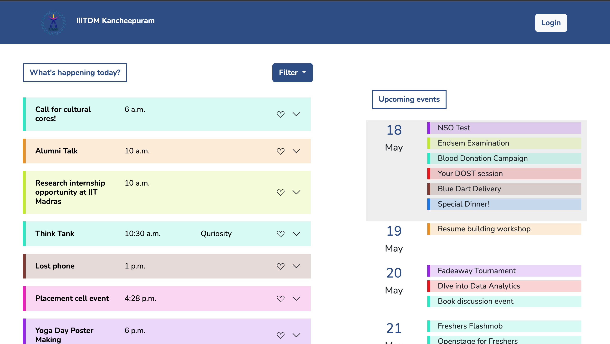
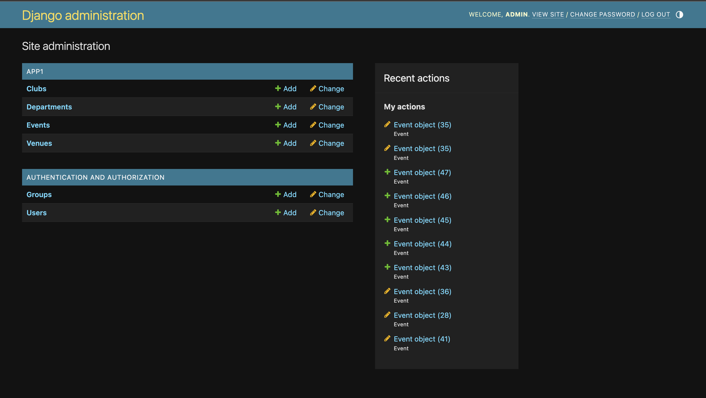
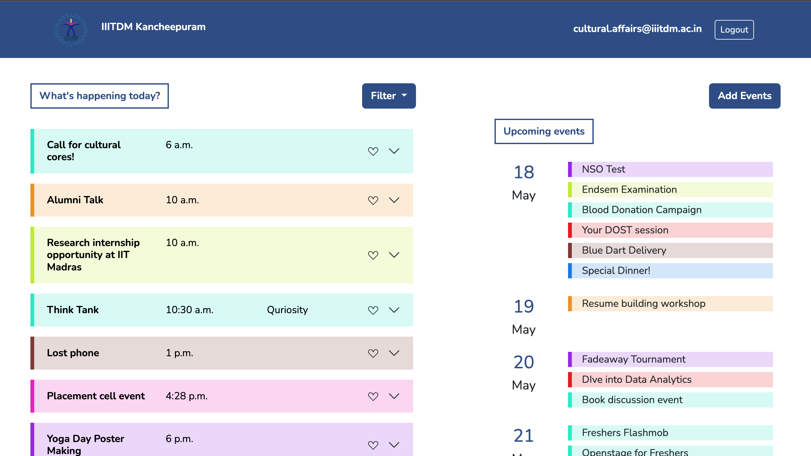

# Campus Event Management

The project seeks to establish a centralized hub where students and staff of the Institute can access information regarding events like cultural festivities, academic seminars, sports competitions, and alumni gatherings taking place on campus. By consolidating event details into a single platform, the aim is to provide easier access to event information and a wider reach to the intended audience.Ultimately, the project endeavors to enhance the overall campus experience by facilitating greater participation, connectivity, and enjoyment among students, faculty, staff, and alumni.

The project is implemented using the Django framework and MySQL as the Database Management System. For the frontend, we have made use of HTML, CSS and Bootstrap.



## Table of Contents

- [Installation](#installation)
- [Usage](#usage)
- [Documentation](#documentation)
- [Credits](#credits)

## Installation

Make sure you have Python, MySQL and Django installed on your system.

Clone the repo
```bash
git clone https://github.com/jyolx/CEMS.git
```
Navigate to the src directory and install all required python packages
```bash
cd CEMS/src
pip install -r requirements.txt 
```

## Usage

### Setting up

Change the database password to your mysql root password in [src/CEMS/settings.py under DATABASES["PASSWORD"]](https://github.com/jyolx/CEMS/blob/ebc783440e8107abdc214d9a26667c4a77e44826/src/CEMS/settings.py#L91)

Create CEMS database in MySQL 
~~~~sql
CREATE DATABASE CEMS;
USE CEMS;
~~~~

The required tables in MySQL have to be created through Django. Run

```bash
cd CEMS/src/
python manage.py migrate
```

Run Server

```bash
python manage.py runserver
```

Visit http://127.0.0.1:8000/ with your web browser to see the code in action!


### Creating Admin User

Create Admin User or a Django Super user

```bash
python manage.py createsuperuser
```

Navigate to http://127.0.0.1:8000/admin/ to login as Super user. 

### Adding Data 

In the Django Administration Dashboard, add users,departments,clubs and Venue.



### Adding Events

To give permissions to users to Add events in the website, Go to the Django Administration Dashboard and do the following :
- Create a Group called 'authorised'
- Go to the required user and under Permissions -> Groups, add 'authorised' group.

To add events, login as an authorised user.



### Favouriting Events

Login as a user and start liking all your favourite events!


## Documentation

The docs folder contains the initial Software Requirements Specifications and the later Report for this project.
 
For the initial values we used for the database, check out the db folder.

## Credits

This project was done under our Database Systems Course.

### Authors : 

<a href="https://github.com/justavanee">
  
</a>
<a href="https://github.com/jyolx">
  
</a>
<a href="https://github.com/nimishathallapally">
  
</a>
<a href="https://github.com/meghahaa">
  
</a>
<a href="https://github.com/deshna2thunga0">
  
</a>


